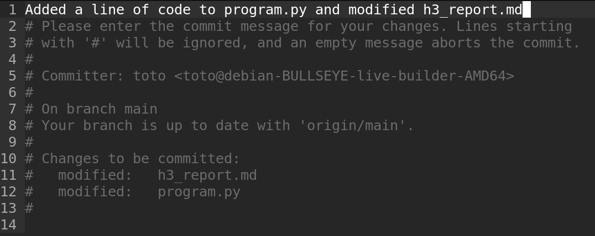
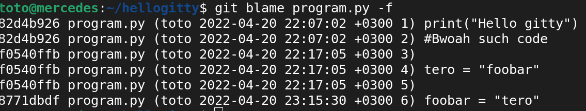

# H3: Versiohallintaa

## a) Markdown. 

Look ma! I'm marking down!

## b) Pull First.

Loin Github käyttäjä 'ottohaagahelia' oppitunnin aikana. Annoin githubille julkisen ssh-avaimen. Githubissa loin uuden julkisen kansion 'hellogitty', jolle annoin GNU GPL v2.0 lisenssin ja README.md tiedoston. Kloonasin github kansion omalle virtuaalikoneelle. Loin h3_report.md markdown tiedoston raportointia varten, sekä program.py python ohjelmatiedoston. Lisäsin ja synkronoin gitin ja githubin kansiot.

	clone git clone ssh://git@github.com/ottohaagahelia/hellogitty
	cd hellogitty
	nano h3_report.md
	nano program.py
	git add .
	git commit
	git pull
	git push

Tein muutoksia git kansion tiedostoihin Teron antamien marssikäskyjen mukaisesti. Annoin erittäin hyvän kuvauksen (commit message). Lopputulos näkyy ruudunkaappauksesta alla.

## c) Kaikki kirjataan.

Komento 'git log' tulostaa kaikki 'commit message' viestit, joita olen lisännyt jokaisen 'git commit' komennon jälkeen. Komento 'git diff' ei tee mitään git kansiossa, ja kun yritin selvittää mitä se tekee ohjeet olivat positiivisesti hepreaa. Komennolla 'git blame program.py -f' voi tulostaa git kansiossa olevien tiedostonjen muokkaukset, sekä nähdä kuka teki ja milloin nämä muutokset.

	git log
	git diff
	git blame program.py -f

## d) Huppis!

Muokkasin 'program.py' tiedostoa, ja lisäsin sinne aivan järjettömän vaarallista ja tuhoisaa koodia. Tyhmänä nuorena ehdin jo ajaa 'git add .' komennon. Sen sijaan, että julkaisin tämän virtuaalisen synnin maailmalle, päätin poistaa muutoksen 'git reset --hard' komennolla. Voila vaarallinen koodirivi on poistettu ja maailma saa levätä rauhassa.

## e) Formula.

Kimi Räikkönen on maailmanmestari.
